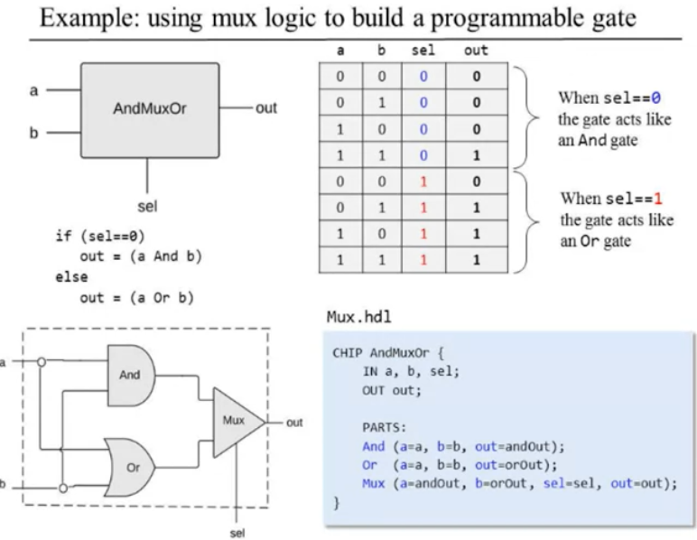
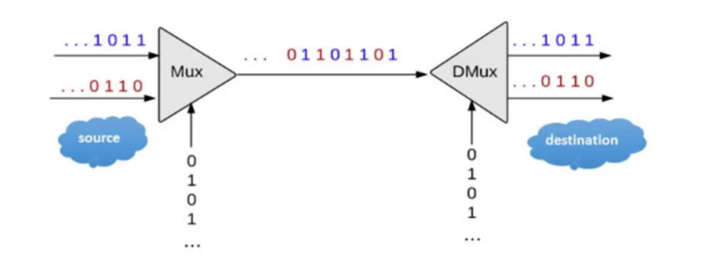
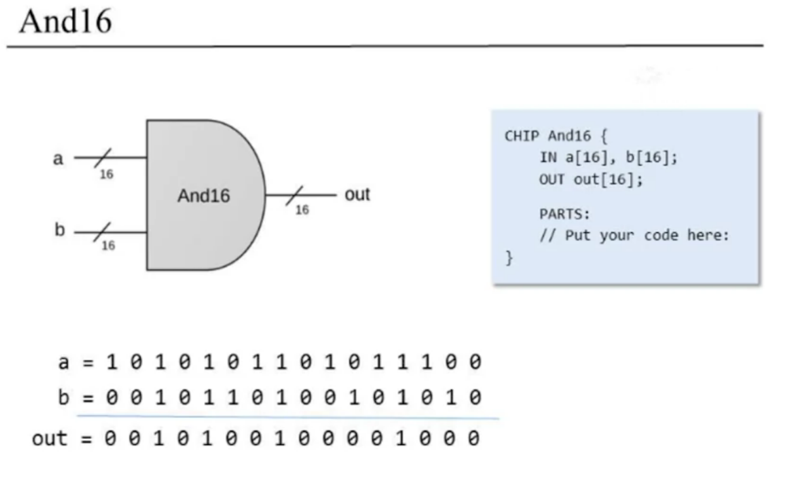
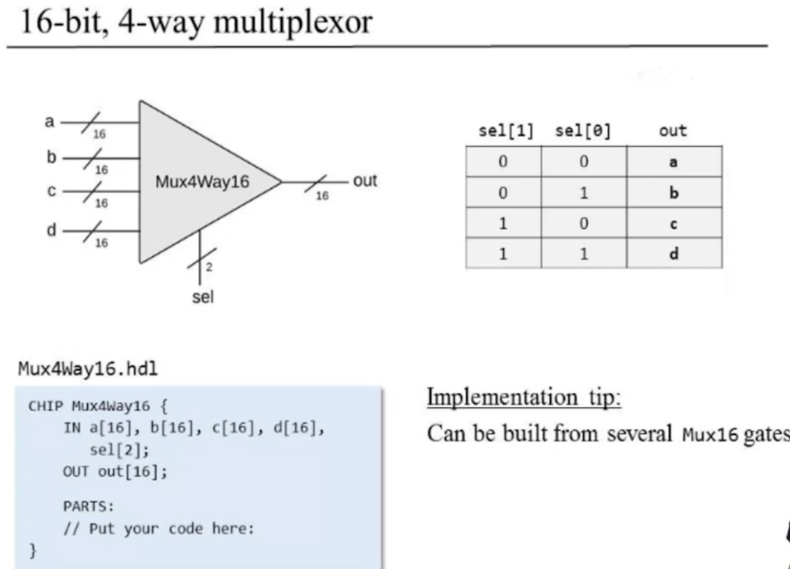
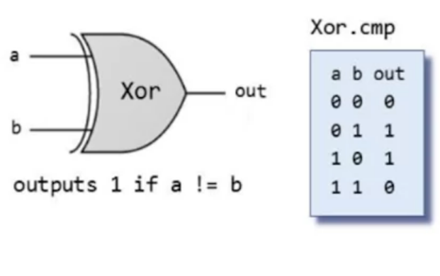

PROJECT 1 
=

Hardware Simulator languages


* **Verilog** is a hardware description language (HDL) used to model and simulate digital systems. It is a procedural language, which means that it describes the behavior of a circuit in terms of steps. Verilog is widely used in the semiconductor industry for designing digital integrated circuits (ICs) and field-programmable gate arrays (FPGAs).
* **VHDL** (VHSIC Hardware Description Language) is another popular HDL that is used to describe the structure and behavior of digital systems. VHDL is a more declarative language than Verilog, which means that it describes the behavior of a circuit in terms of its structure and inputs/outputs. VHDL is also widely used in the semiconductor industry for designing digital ICs and FPGAs.
* **SystemVerilog** is a newer HDL that is based on Verilog. It combines the strengths of Verilog and VHDL, and adds new features such as object-oriented programming and assertions. SystemVerilog is becoming increasingly popular in the semiconductor industry, and is often used for designing complex digital systems.
* **Bluespec** is a newer HDL that is based on the Haskell programming language. It is designed to be more expressive and concise than Verilog or VHDL, and it can be used to describe both the behavior and structure of digital systems. Bluespec is not as widely used as Verilog or VHDL, but it is gaining popularity in some circles.
* **Cadence Incisive** is a proprietary HDL that is used by the Cadence Design Systems company. It is a powerful HDL that can be used to describe both the behavior and structure of digital systems. Cadence Incisive is not as widely used as Verilog or VHDL, but it is often used for designing complex digital systems.

These are just a few of the many HDLs that are available. The best HDL for a particular project will depend on the specific requirements of the project.

- Given: `Nand`
- Goal: Build the following gates:
  - `Not`
  - `And`
  - `Or`
  - `Xor`
  - `Mux`
  - `Dmux`
  - `Not16`
  - `And16`
  - `Or16`
  - `Mux16`
  - `Or8Way`
  - `Mux4Way16`
  - `Mux8Way16`
  - `DMux4Way`
  - `DMux8Way`
  
  Elementary logic gates
  -

  - `Not`
  - `And`
  - `Or`
  - `Xor`
  - `Mux`
  - `Dmux`


  16-bit variants
  -

  - `Not16`
  - `And16`
  - `Or16`
  - `Mux16`


  Multi-way variants
  -

  - `Or8Way`
  - `Mux4Way16`
  - `Mux8Way16`
  - `DMux4Way`
  - `DMux8Way`


Multiplexor
-


```h
if (sel==0)
  out=a
else
  out=b
```

|a|b|sel|out|
|-|-|-|-|
|0|0|0|0||
|0|1|0|0||
|1|0|0|1||
|1|1|0|1||
|0|0|1|0||
|0|1|1|1||
|1|0|1|0||
|1|1|1|1|

|sel|out|
|--|--
|0|a|
|1|b|

- A 2-way multiplexor enables selecting, and outputting, one out of two possible inputs.
- Widely used in:
    - Digital design
    - Communications networks

- Using mux logic to build a programmable gate <br>


Demultiplexor
-


```h
if (sel==0)
  {a,b}={in,0}
else
  {a,b}={0,in}
```
|in|sel|a|b|
|-|-|-|-|
|0|0|0|0|
|0|1|0|0|
|1|0|1|0|
|1|1|0|1|

- Acts like the "inverse" of a multiplexor.
- Distributes the single input value into one of two possible destinations.
  
- DMux.hdl

```h
CHIP DMux {
  IN in, sel;
  OUT a,b;

  PARTS:
  // Enter code here
}
```

Example: Multiplexing/ demultiplexing in communication networks
-



- Each `sel ` bit is connected to an oscillator that produces a repetitive train of alternating 0 and 1 signals.
- Enables transmitting multiple messages on a single, shared communications line
-  A common use of multiplexing / demultiplexing logic


16-bit variants
-

- `Not16`
- `And16`
- `Or16`
- `Mux16`

  And16
  -

  

Multi-way variants
- 
 
  Mux4Way16
  - 
  
  
  

Chip building materials(using Xor as an example)
-



 - The contract: _When running your `Xor.hdl` on the supplied <br> `X0r.tst` your `Xor.out` should <br>be the same as the supplied `Xor.comp`_

- Xor.hdl
  
  ```h
  CHIP Xor {
    IN a, b;
    OUT out;

    PARTS:
    // Put your code here
  }
  ```
- Xor.tst
  ```h
  load.Xor.hdl,
  output-file Xor.out,
  compare-to Xor.cmp,
  output-list a b out;
  set a 0, set b 0, eval, output;
  set a 0, set b 1, eval, output;
  set a 1, set b 0, eval, output;
  set a 1, set b 1, eval, output;
  ```