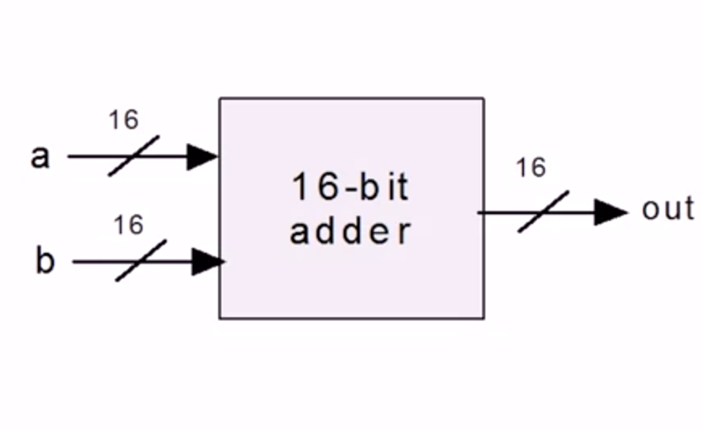

Array of Bits
=

- Sometimes we manipulate "together" an array of bits.
- It is conceptually convenient to think about such a group of bits as a single entity, sometime termed "bus"
- HDLs will usually provide some convenient notation for handling these buses.


Multi-Bit Buses
=



Example: Addition of two 16-bit integers
-

```
      a(16)
input ----> |16-bit adder| ---> out(16)
      a(16)
```

Buses in HDL
-

```h
/*
* Adds two 16-bit values.
*/
CHIP Add16 {
  IN a[16], b[16];
  OUT out[16];

  PARTS:
    ...
}
```

```h
/*
* Adds three 16-bit values.
*/
CHIP Add3Way16 {
  IN first[16], second[16], third[16];
  OUT out[16];

  PARTS:

    Add16(a=first, b=second, out=temp);
    Add16(a=temp, b=third, out=out);
}
```

Working with Bits in Buses
-

```h
/*
* ANDs together all 4 bits of the input.
*/
CHIP And4Way{
  IN a[4];
  OUT out;

  PARTS:
    AND(a=a[0], b=a[1], out=t01);
    AND(a=t01, b=a[2], out=t012);
    AND(a=t012, b=a[3], out=out);
}
```

```h
/*
* Computes a bit-wise and of its two 4-bit
* input buses
*/
CHIP And4{
  IN a[4], b[4];
  OUT out[4];

  PARTS: 
    AND(a=a[0], b=b[0], out=out[0]);
    AND(a=a[1], b=b[1], out=out[1]);
    AND(a=a[2], b=b[2], out=out[2]);
    AND(a=a[3], b=b[3], out=out[3]);
}
```

Sub-buses
-

- Buses can be composed from (and broken into ) sub-buses

```h
...
IN lsb[8], msb[8], ...
...
Add16(a[0..7]=lsb, a[8..15]=msb, b=.., out=...);
Add16(..., out[0..3]=t1, out[4..15]=t2);
```

- Some syntatic choices of project HDL
  - Overlaps of sub-buses are allowed on output buses of parts
  - Width of internal pins is deduced automatically
  - `false` and `true` may be used as buses of any width

  Question
  -

  This is the interface declaration for an example chip named Example16, which we haven't discussed before:
  ```h
    IN c, Bus1[16], Bus2[16];

    OUT out, out2[16];
  ```
  Which of these lines are valid in HDL, when implementing the Example16 chip?

  - [ ] Add16(a=Bus1[0..15], b=Bus2[0..15], out=out2[0..14]);
  - [x] Add16(a=Bus1[0..15], b=Bus2[0..15], out[0..14]=out2[0..14]); <br>
  `out[0..14]=out2[0..14] means that we're discarding the most significant bit of Add16's out, and using the rest to connect to the 15 least significant bits of Example16's out2.`
  - [x] Add16(a=true, b=false, out=out2);<br>
  `True and false can represent a bus with constant signal of arbitrary width.`
  - [ ] Add16(a=c, b=Bus2[0..15], out=out2);
  - [x] And(a=c, b=Bus2[7], out=out);<br>
  `This works, because And expects single bits as input 'a' and 'b'.`

