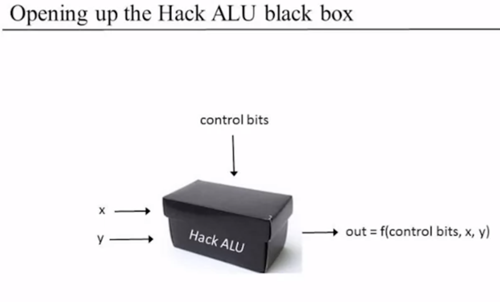

Addition
-


Building an Adder
=


Half Adder: adds two bits
-


A half adder is a basic digital circuit that adds two binary digits (bits) and produces a sum and a carry. It has two inputs, A and B, representing the bits to be added, and two outputs, Sum (S) and Carry (C). The half adder can handle the addition of individual bits but cannot account for any carry from previous addition operations.

|a|b|sum|carry|
|-|-|---|-----|
|0|0|0|0|
|0|1|1|0|
|1|0|1|0
|1|1|0|1

```asm
CHIP HalfAdder {
    IN a, b;    // 1-bit inputs
    OUT sum,    // Right bit of a + b 
        carry;  // Left bit of a + b

    PARTS:
    // Put you code here:
    Xor(a=a, b=b, out=sum);
    And(a=a, b=b, out=carry);
}
```

Full Adder: adds three bits
-


A full adder is an extension of the half adder that includes an additional input, the carry input (Cin), which takes into account the carry generated by previous addition operations. In addition to the A and B inputs, a full adder has three outputs: Sum (S), Carry (Cout), and a carry output to be propagated to the next stage of the addition.

|a|b|c|sum|carry|
|-|-|-|---|-----|
|0|0|0|0|0|
|0|0|1|1|0|
|0|1|0|1|0|
|0|1|1|0|1|
|1|0|0|1|0|
|1|0|1|0|1|
|1|1|0|0|1|
|1|1|1|1|1|


```
CHIP FullAdder {
    IN a, b, c;  // 1-bit inputs
    OUT sum,     // Right bit of a + b + c
        carry;   // Left bit of a + b + c

    PARTS:
    // Put you code here:
    HalfAdder(a=a, b=b, sum=half_sum,carry=half_carry);
    HalfAdder(a=half_sum, b=c, sum=sum, carry=c1);
    Or(a=half_carry, b=c1, out=carry);
}
```


Multi-bit Adder
-


Adder: adds two numbers
-

An adder is a more complex circuit that combines multiple full adders to add multi-bit binary numbers. It typically consists of cascaded full adders, with each full adder taking care of a specific bit position. The carry output (Cout) of one full adder is connected as the carry input (Cin) of the next full adder, enabling the addition of multiple bits and accounting for any carries generated during the process.

- 16-bit adder


- out = a + b, as 16-bit integers(overflow ignored)

```
CHIP Inc16 {
    IN in[16];
    OUT out[16];

    PARTS:
   // Put you code here:
    HalfAdder(a=a[0],b=b[0],sum=out[0],carry=carry1);
    FullAdder(a=a[1],b=b[1],c=carry1,sum=out[1],carry=carry2);
    FullAdder(a=a[2],b=b[2],c=carry2,sum=out[2],carry=carry3);
    FullAdder(a=a[3],b=b[3],c=carry3,sum=out[3],carry=carry4);
    FullAdder(a=a[4],b=b[4],c=carry4,sum=out[4],carry=carry5);
    FullAdder(a=a[5],b=b[5],c=carry5,sum=out[5],carry=carry6);
    FullAdder(a=a[6],b=b[6],c=carry6,sum=out[6],carry=carry7);
    FullAdder(a=a[7],b=b[7],c=carry7,sum=out[7],carry=carry8);
    FullAdder(a=a[8],b=b[8],c=carry8,sum=out[8],carry=carry9);
    FullAdder(a=a[9],b=b[9],c=carry9,sum=out[9],carry=carry10);
    FullAdder(a=a[10],b=b[10],c=carry10,sum=out[10],carry=carry11);
    FullAdder(a=a[11],b=b[11],c=carry11,sum=out[11],carry=carry12);
    FullAdder(a=a[12],b=b[12],c=carry12,sum=out[12],carry=carry13);
    FullAdder(a=a[13],b=b[13],c=carry13,sum=out[13],carry=carry14);
    FullAdder(a=a[14],b=b[14],c=carry14,sum=out[14],carry=carry15);
    FullAdder(a=a[15],b=b[15],c=carry15,sum=out[15],carry=carry16);
}
```

Negative Numbers
-

Representing negative numbers using the sign bit:

1. `Sign-Magnitude Representation:`


In sign-magnitude representation, the sign bit is used to indicate the sign of the number, where 0 represents a positive number and 1 represents a negative number. The remaining bits represent the magnitude or absolute value of the number. For example:

  - Positive number: 0110 (6 in decimal)
  - Negative number: 1110 (-6 in decimal)

```
0000-----0
0001-----1
0010-----2
0011-----3
0100-----4
0101-----5
0110-----6
0111-----7
1000-----(-0)
1001-----(-1)
1010-----(-2)
1011-----(-3)
1100-----(-4)
1101-----(-5)
1110-----(-6)
1111-----(-7)
```

Drawbacks of using sign-magnitude:
-

1. `Difficulty in Arithmetic Operations`: Performing arithmetic operations such as addition, subtraction, and multiplication with sign-magnitude numbers requires additional logic. Different rules apply depending on whether the numbers being operated on have the same sign or opposite signs. This complicates the arithmetic circuitry and adds complexity to the computation process.

2. `Multiple Representations of Zero`: In sign-magnitude representation, there are two ways to represent zero: one with a positive sign bit (e.g., 0000) and one with a negative sign bit (e.g., 1000). This redundancy can cause confusion and lead to inconsistencies in mathematical operations.

3. `Limited Range`: Sign-magnitude representation limits the range of representable numbers due to the need to reserve one bit for the sign. For example, in an 8-bit system, sign-magnitude representation can only represent numbers from -127 to 127, whereas two's complement representation can represent numbers from -128 to 127 using the same number of bits.

4. `Difficulty in Comparison`: Comparing sign-magnitude numbers is more complex compared to two's complement. It requires additional logic to compare the sign bits and magnitude separately, which can result in slower and more complicated comparison operations.

5. `Inefficient Storage`: Sign-magnitude representation requires additional storage space to store the sign bit separately from the magnitude. This can be a disadvantage in memory-constrained systems or when dealing with large datasets.


Two's Complement Representation:
In two's complement representation, the sign bit is also used to indicate the sign of the number. However, the remaining bits represent the two's complement of the magnitude of the number. To obtain the two's complement of a positive number, invert all the bits and add 1 to the least significant bit. For example:

Positive number: 0110 (6 in decimal)
Negative number: 1010 (-6 in decimal)
The two's complement representation has the advantage of simplifying arithmetic operations, as addition and subtraction can be performed using the same logic regardless of the sign.

2. `Two's Complement Representation:`
   

In two's complement representation, the sign bit is also used to indicate the sign of the number. However, the remaining bits represent the two's complement of the magnitude of the number. To obtain the two's complement of a positive number, invert all the bits and add 1 to the least significant bit. For example:

  - Positive number: 0110 (6 in decimal)
  - Negative number: 1010 (-6 in decimal)
  
The two's complement representation has the advantage of simplifying arithmetic operations, as addition and subtraction can be performed using the same logic regardless of the sign.

Computing x
-

To compute -x in two's complement representation, you can use the following steps:

 - Determine the bit-width of the representation. Let's assume it is n bits.

 - Compute the value ${2^n - x}$  This can be done by subtracting x from $2^n$.

- Add 1 to the result from step 2. This accounts for the negative sign.

- If the result from step 3 requires more than n bits to represent, truncate the most significant bits to fit within the n-bit representation. This ensures that the result is represented using the given bit-width.

- The final result is the two's complement representation of $-x$.

Let's illustrate this with an example:

 - Suppose we have a 4-bit representation (n=4) and the input value is $x = 5$.

 - The bit-width is 4, so $n = 4$.

 - Compute $(2^4 - 5) = 11. (16 - 5 = 11)$.

 - Add 1 to the result: $11 + 1 = 12$.

- Since the result, 12, can be represented in 4 bits (1100), no truncation is needed.

- Therefore, the two's complement representation of -5 is 1100.


Arithmetic Logic Unit
=

The ALU is a fundamental component of the central processing unit (CPU) in a computer. Its main purpose is to perform arithmetic and logical operations on binary data. In the context of the Hack computer architecture, the ALU is responsible for executing arithmetic operations and determining the outcomes of logical operations.


 The ALU (Arithmetic Logic Unit) is a crucial component of the Hack computer's CPU. It performs arithmetic and logical operations on 16-bit binary data. Control signals determine the specific operation, such as addition, subtraction, or logical operations. The ALU is extensively used in executing instructions, performing calculations, and updating registers or memory locations. It plays a vital role in the overall functionality of the Hack computer.


Von Neumann Architecture
-


- The ALU computes a function on the two inputs, and outputs the result
- The function `f`: is one out of a family of pre-defined arithmetic and logical functions
  - Arithmetic operations: integer addition, multiplication, division, ...
  - logical operations: And, Or, Xor, ...


Hack ALU
-

- Operates on two 16-bit, two's complement values
- Outputs a 16-bit, two's complement value
- Which function to compute is set by six 1-bit inputs
- Computes one out of a family of 18 functions
- Also outputs two 1-bit values
- 




The Hack ALU Operation
-

- There are six control bits that determine the operation to be performed on the inputs. These control bits specify the desired operation and control the various multiplexers and logic gates within the ALU.

 - `zx` (Zero X input): When zx is set to 1, it forces the value of the X input to be zero.

 - `nx` (Not X input): When nx is set to 1, it performs a bitwise negation of the X input.

 - `zy` (Zero Y input): When zy is set to 1, it forces the value of the Y input to be zero.

 - `ny` (Not Y input): When ny is set to 1, it performs a bitwise negation of the Y input.

 - `f` (Function): The function bit determines the operation to be performed on the X and Y inputs. If f is set to 0, the ALU performs a bitwise logical AND operation. If f is set to 1, the ALU performs a bitwise logical OR operation.

 - `no` (Not output): When no is set to 1, it performs a bitwise negation of the ALU's output.

- By manipulating these control bits, various arithmetic and logical operations can be performed by the Hack ALU, such as addition, subtraction, bitwise AND, bitwise OR, and more. 


- Example 


 


- The Hack ALU output control bits

```
if (out == 0) then zr = 1, else zr = 0 
if(out<0) thenng=1,else ng=0
```
- These two control bits will come into play when we build the complete computer's architecture.

Summary:

The Hack ALU is:

- simple
- elegant
- easy to implement:
  - set a 16-bit value to `0000000000000000`
  - set a 16-bit value to `1111111111111111`
  - negate a 16-bit value (bit-wise)
  - compute + or & on two 16-bit values
  