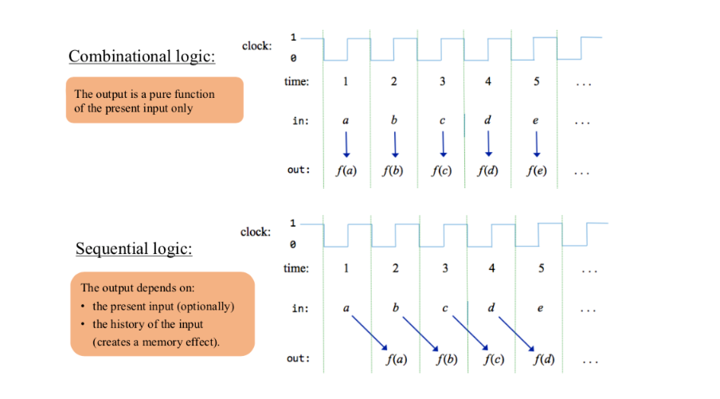
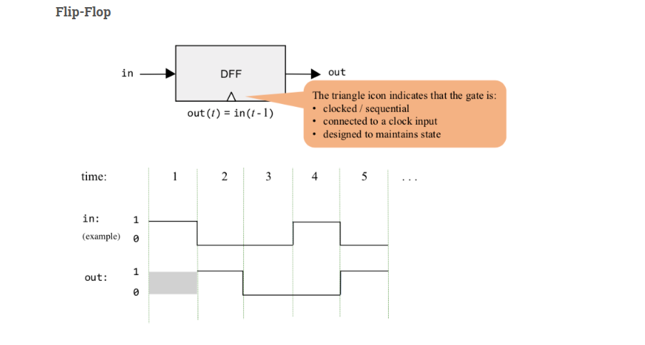
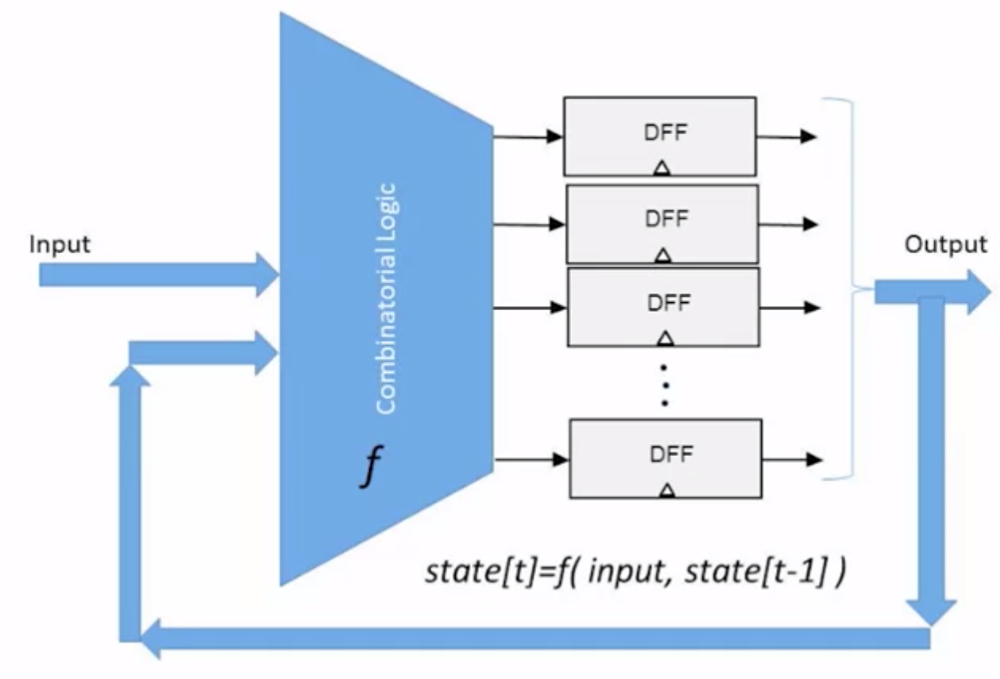
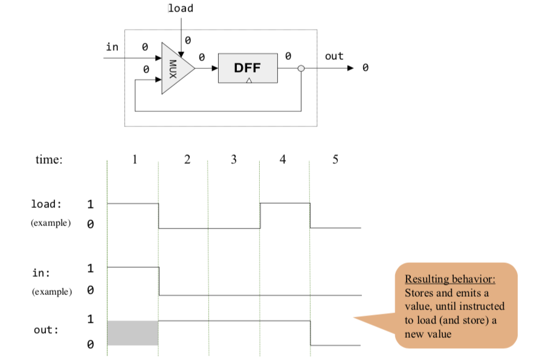
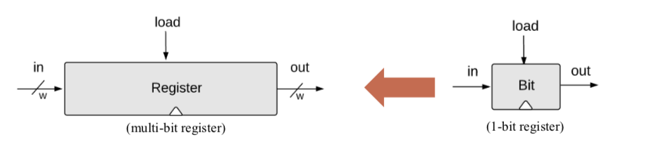

Sequential Logic
=

Combinatorial logic
-

- `Combinatorial logic` refers to a type of digital logic design where the output depends only on the current input values. It uses logic gates, like AND, OR, and NOT, to perform logical operations without any memory or feedback. The output is determined solely by the input, making it immediate and independent of past inputs or time. Combinatorial logic is used in various digital systems and does not involve memory or state.

 - `Combinatorial chips` compute functions that depend solely on combinations of their input values. These relatively simple chips provide many important functions (like the ALU), but they cannot `maintain state`. Since computers must be able to not only compute values but also store and recall values, they must be equipped with memory elements that can preserve data over time. These memory elements are built from `sequential chips`.



Why is time important
-

- Time is crucial in combinatorial logic circuits.
- Inputs are processed immediately and outputs are produced without delay.
- Timing constraints, such as propagation delay and setup/hold times, must be considered.
- Proper timing ensures the functionality and synchronization of the digital system.
- Violations of timing requirements can lead to data corruption and unreliable behavior.
- Timing optimization is necessary for high-speed circuits and sequential operations.
- Use the same hardware over time
  - Inputs change and outputs should follow
  - E.g 
   
  
  ```
  For i=1...100:
    a[i]=b[i]+c[i]
  ```
- Remember `State`
  - Memory
  - Counters
  - E.g 
  
    ```
    For i=1...100
      sum+=1
    ```

- Deal with speed


The Clock
=

Physical Time

- We use discrete time steps to ensure the system state is stablized
- Discrete time steps are used in digital systems because they provide precise and predictable behavior.
- Digital systems are less susceptible to noise and interference compared to analog systems, as discrete voltage levels provide better immunity.
Discrete time steps simplify the design and analysis of digital circuits, as they can be modeled using Boolean algebra and logic gates.
- The use of discrete time allows for the implementation of complex operations using simple digital components, enabling efficient and scalable designs.

Combinatorial Logic vs Sequential Logic
-

- Combinatorial: $out[t]$ = $function(in[t])$

|Time|1|2|3|4
|-|-|-|-|-
|in|a|b|c|d|---
|out|f(a)|f(b)|f(c)|f(d)

- Sequential: $out[t]$ = $function(in[t-1])$

|Time|1|2|3|4
|-|-|-|-|-
|in|a|b|c|d|---
|out||f(a)|f(b)|f(c)

|Time|1|2|3|4
|-|-|-|-|-
|state|a|b=f(a)|c=f(b)|d=f(c)


Flip Flops
=

Remembering state:

  - Missing ingredient: remember one bit of information from time $t-1$ so it be used at time t.
  - At the "end of time" $t-1$, such an ingredient can be at either of two states: "remembering 0" or "remembering 1".
  - This ingredient remembers by "flipping" bewteen these two possible states.
  - Gates that can flip between two states are called Flip-Flops.



Implementation of the D Flip Flop
- It is a primitive
- In many physical implementations, it may be built from actual Nand gates:
  - Step 1: create a loop achieving an unclocled flip-flop
  - Step 2: Isolation across time steps using a master-slave setup

-  It is elegant but conceptually confusing
-  The Hardware Simulator in our case forbids "comninatorial loops"

  - A cycle in the hardware connections is allowed only if it passes through a sequential gate

>A by the way:
 > D Flip-Flop Truth Table:

>Inputs: D (data input), CLK (clock input)
>Outputs: Q (flip-flop output), Q̅ (complement of Q)
>The flip-flop state changes on the rising edge or falling edge of the clock signal, depending on the type.
>Implementation Steps:

>Use logic gates (such as NAND, NOR, or a combination) to create a circuit that performs the desired flip-flop functionality.
>Connect the D input to the appropriate gate(s) to control the data input.
>Connect the CLK input to control the clock signal.
>Connect the output(s) to obtain the Q and Q̅ outputs.
>Additional Considerations:

>Power supply: Provide the necessary power supply to the flip-flop circuit.
>Clock signal: Ensure the clock signal meets the timing requirements for the specific flip-flop type.




1-bit  Register: Remembering Forever
=

- Goal: remember an input bit "forever": until requested to load a new value

```
if load(t-1) then out(t)=in(t-1)
else out(t)=out(t-1)
```

- A single-bit register, which we call Bit, or binary cell, is designed to store a sigle bit of information (0 or 1). The chip interface consists of
  - an `input pin` that carries a data bit
  - a `load pin` that enables the cell for writes
  - an `output pin` that emits the current state of the cell


- Read: to read the contents of a register, we simply probe its output
- Write: to write a new data value `d` into a register, we put `d` in the input and assert (set to 1) the load input. In the next clock cycle, the register commits to the new data value, and its output starts emitting `d`
- DFF always stores the "in" bit, while Bit only stores it if "load" is set to 1.
- DFF can store information for one time unit only, while Bit can store it for many cycles.



Memory
=

- Memory
  - Main memory: RAM
  - Secondary memory: disks
  - Volatile/ non-volatile

- RAM
  - Data
  - Instructions

- Perspective
  - Physical
  - Logical


Register: 
-

The most basic memory element

Multi-bit register(register)
-




- A `w-bit` register can be created from an array of  1-bit registers
- Register's state: the value which is currently stored inside the register

 Register: read logic
  -

  To read the register:
  
  ```
  probe out
  ```

  Result

  ```
  out emits the Register's state
  ```

   Register: write logic
  -

  To read the register=v:
  
  ```
  set in = v
  set load = 1
  ```

  Result

  ```
  The Register's state becomes v
  From the next cycle onward, out emits v
  ```